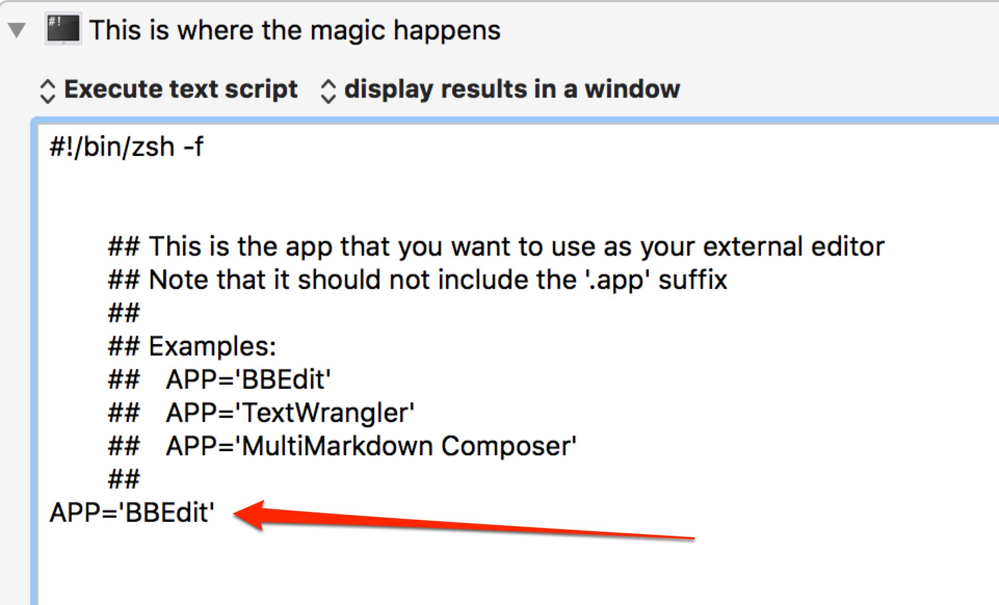

edit-anywhere
=============

**Summary:** A quick-and-dirty attempt at implementing [QuickCursor][1] using [BBEdit][2] and [Keyboard Maestro][3].

**For those who aren't familiar with QuickCursor:**
QuickCursor did one thing really well: anywhere you could edit text, it would send that text to [your favorite text editor][2] and then when you closed that file, it would send the text back to the original application.

So, for example, if you were using Google Chrome to write an email in GMail but wanted to write it in BBEdit, you would just press your keyboard shortcut for QuickCursor, it would select all of the text (or just part of it if you had some already selected), cut it, open it in BBEdit, wait for you to finish, and then switch back to Google Chrome and paste the text that you had written in BBEdit.

Got it? Good. (If not, watch [the YouTube video for QuickCursor][4].)

### If QuickCursor is so great, why are you using this? ###

In a word: [sandboxing][5]. QuickCursor was killed by sandboxing.

This annoyed me for several reasons. QuickCursor was the first app that I bought from the Mac App Store. But most of all I really missed being able to edit text in BBEdit from anywhere.

### How does this work? ###

Like so:

1. User presses a keyboard shortcut which has been defined in Keyboard Maestro which triggers a macro which I call 'edit anywhere' (or "EA" for short).

2. EA checks to see if the menu item 'cut' is enabled. 
	*	if yes, then EA assumes that you have some text selected, and that is the text you want to edit.
	*	if no, EA will do 'Select All' (using either the menu item or ⌘ + A depending on which is available)
	
3.	EA will then 'cut' the text from step 2 and save it to a file `~/edit_anywhere.txt`. That file is in your home directory, which means that:
	*	you can save it as often as you like
	*	if you reboot your computer (or, heaven forbid, it crashes) the file will still be there
	*	it is secure, at least in as much as no one else should be able to read it unless they already have access to your account.
	
4.	EA will then open the file in your editor of choice
	*	If you use BBEdit and have the `bbedit` command-line tool installed, the script will use that. The file will open in BBEdit and the script will pause until you close the file in BBEdit. You do not have to quit the BBEdit app, just close the window or ‘tab’ where you had been editing the document.  (Note: if you purchased BBEdit from the Mac App Store you will have to [download and install the command line tools from BareBones.com][6].)

	*	If you use another editor, it will be opened using `open -a YourAppHere -n -W` which means that a new instance of the app will be opened (even if it is already running) and the script will wait until that _instance_ of the app has quit (not just the window closed, but the app quit).

5. EA will then paste the contents of `~/edit_anywhere.txt` into the original app.

8. EA will then rename the `~/edit_anywhere.txt` file to something like `edit_anywhere.2015-08-05--16.30.15.txt` (representing the current date and 24h-time) and move it to the trash (~/.Trash/). This is intended as a safety net in case you need to recover text from the file for some reason. (For example, if pasting the contents of the file into the original app did not work for some reason.)

### There are a few provisos, a couple of *quid pro quos*.

* This will only work in ‘regular’ applications. Specifically, if will ***not*** work in applications which only exist in the menu bar. This limitation was present in QuickCursor too. When in doubt, I recommend testing the “round trip” in your app of choice to make sure that it works as expected.

### Future Feature Ideas

* Now the the script knows which app that the content came from, it would be fairly easy to define different text editors depending on which app sent the text. For example, when you invoke this macro from Scrivener, it could open MultiMarkdown Composer or Byword instead of your regular app. 

### FAQ: “How do I use a different app besides BBEdit?”

The macro assumes you want to use BBEdit unless you change the `APP=` variable in the script section of the macro, as shown here:

### FAQ: “How do I install this?”

1.	[Download the macro](https://github.com/tjluoma/edit-anywhere/raw/master/Edit-Anywhere.kmmacros) (right click on that link and use save as, or equivalent.)

2.	Make sure the file extension is `.kmmacros` (Be sure that your browser did  ***not*** rename it to something like `.kmmacros.txt`)

3.	Double-click the file to add it to Keyboard Maestro. If it does not open in Keyboard Maestro, see Step #2. (Use the Inspector in Finder to check the full filename.)

<!-- footnotes -->
[1]: http://www.hogbaysoftware.com/products/quickcursor
[2]: http://barebones.com
[3]: http://www.keyboardmaestro.com/main/
[4]: http://www.youtube.com/watch?v=-bHwcyHrRGs
[5]: http://www.hogbaysoftware.com/products/quickcursor/faq
[6]: http://www.barebones.com/support/bbedit/cmd-line-tools.html